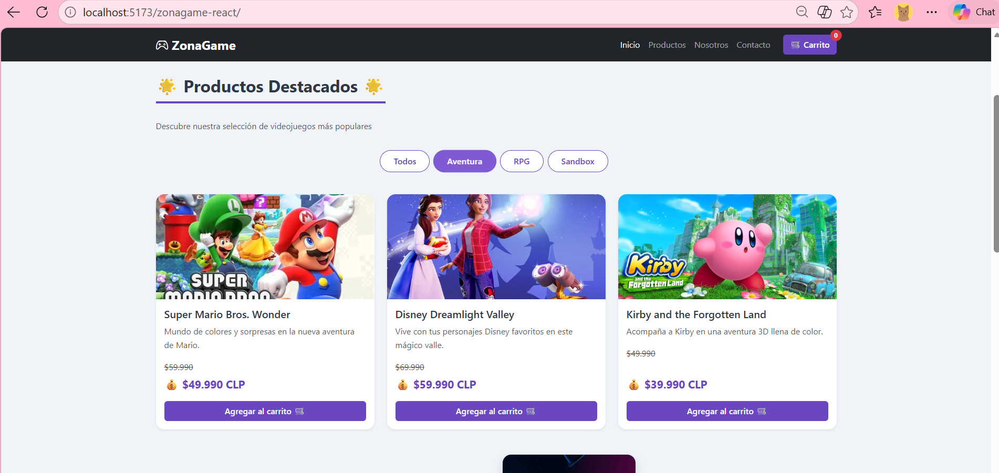
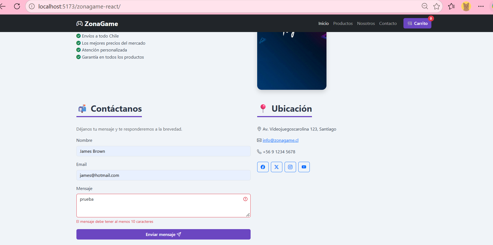
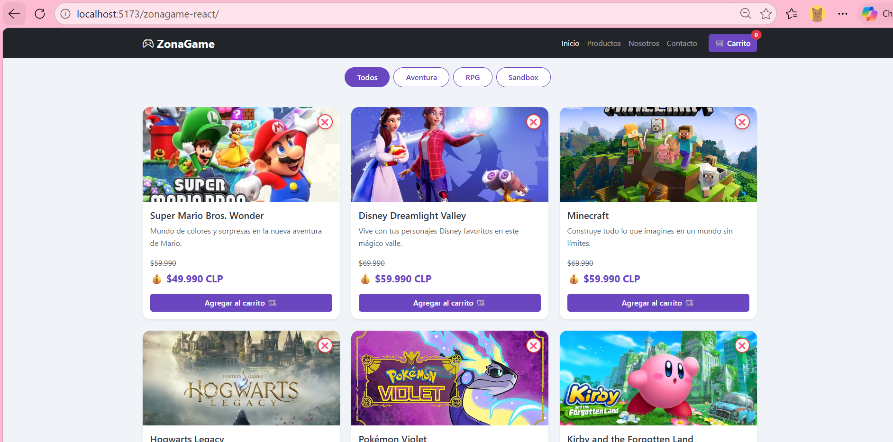

# 🎮 ZonaGame - Tienda de Videojuegos (React)

## EFT - Evaluación Final Transversal
### Desarrollo de un sitio web para tienda de videojuegos con HTML, CSS, JavaScript, Bootstrap 5 y React

---

## Descripción del Proyecto

Aplicación web completa de eCommerce para una tienda de videojuegos llamada **"ZonaGame"**, desarrollada como proyecto final del curso de Frontend. Implementa las siguientes tecnologías y funcionalidades:

- **HTML5** semántico
- **CSS3** personalizado + **Bootstrap 5**
- **JavaScript** con React
- **Hooks** (`useState` y `useEffect`)
- **Renderizado condicional**
- **Persistencia** con `localStorage`
- **Filtrado** por categoría
- **Validación** de formularios
- **Eliminación dinámica** de productos

---

## Funcionalidades Implementadas

### Catálogo de productos
- 6 videojuegos con: nombre, precio normal, precio oferta, descripción, imagen y categoría
- Carga dinámica con **useEffect** (simula una API)
- Spinner de carga mientras se obtienen los datos

### Filtro por categoría
- Botones: **Todos**, **Aventura**, **RPG**, **Sandbox**
- Filtra productos en tiempo real

### Carrito de compras
- Agregar productos con un clic
- Eliminar productos individualmente
- Vaciar el carrito completo
- **Contador dinámico** en la navbar
- **Cálculo automático** del total
- **Persistencia** con localStorage

### Eliminar productos del catálogo
- Botón ❌ en cada tarjeta para eliminar productos

### Formulario de contacto con validación
- Campos: Nombre, Email, Mensaje
- Validación en tiempo real
- Mensajes de error visuales
- Notificación al enviar exitosamente

### Renderizado condicional
- Spinner de carga
- Botón "Agregar al carrito" → "✅ En el carrito"
- Mensaje cuando el carrito está vacío
- Notificación flotante al agregar/eliminar

### Diseño responsivo
- Bootstrap 5
- Adaptable a móvil, tablet y escritorio
- CSS Grid y Flexbox

---

## Estructura del Proyecto

```text
zonagame-react/
├── index.html
├── package.json
├── vite.config.js
├── README.md
├── .github/
│   └── workflows/
│       └── deploy.yml
├── public/
│   └── assets/
│       └── imagenes/
│           ├── mario.jpg
│           ├── disney.jpg
│           ├── minecraft.jpg
│           ├── hogwarts.jpg
│           ├── pokemon.jpg
│           └── kirby.jpg
├── capturas/
│   ├── eft_captura_filtro.png
│   ├── eft_captura_formulario.png
│   └── eft_captura_eliminar.png
└── src/
    ├── components/
    │   ├── Navbar.jsx
    │   ├── ProductoCard.jsx
    │   ├── ListaProductos.jsx
    │   ├── Filtro.jsx
    │   ├── Carrito.jsx
    │   └── FormularioContacto.jsx
    ├── data/
    │   └── productos.js
    ├── App.jsx
    ├── App.css
    ├── index.css
    └── main.jsx
```

---

## Instrucciones de Instalación

### Requisitos previos
- **Node.js** v18 o superior
- **npm** (viene con Node.js)
- Un navegador web moderno

### Pasos de instalación

```bash
# 1. Clonar el repositorio
git clone https://github.com/carosolis45/zonagame-react.git

# 2. Entrar al proyecto
cd zonagame-react

# 3. Instalar dependencias
npm install

# 4. Ejecutar el servidor de desarrollo
npm run dev
```

Abrir en el navegador: `http://localhost:5173/zonagame-react/`

### Comandos disponibles

| Comando | Descripción |
|---------|-------------|
| `npm run dev` | Inicia el servidor de desarrollo |
| `npm run build` | Genera la versión de producción en `dist/` |
| `npm run preview` | Previsualiza la versión de producción |

---

## Capturas de Pantalla

### Filtro por categoría funcionando


### Formulario con validación


### Botón eliminar producto


---

## Tecnologías Utilizadas

| Tecnología | Descripción |
|------------|-------------|
| **HTML5** | Estructura semántica |
| **CSS3** | Estilos personalizados |
| **Bootstrap 5** | Framework responsivo |
| **JavaScript ES6+** | Lógica de la aplicación |
| **React 19** | Biblioteca de componentes |
| **Vite** | Empaquetador y servidor de desarrollo |
| **useState** | Manejo de estados |
| **useEffect** | Efectos secundarios |
| **localStorage** | Persistencia del carrito |
| **GitHub Pages** | Despliegue en línea |
| **GitHub Actions** | CI/CD automatizado |

---

## Enlaces

- **Repositorio:** https://github.com/carosolis45/zonagame-react
- **GitHub Pages:** https://carosolis45.github.io/zonagame-react/

---

## Datos del Estudiante

- **Nombre:** Carolina Solís
- **Curso:** Frontend I
- **Evaluación:** EFT - Evaluación Final Transversal


---

*Proyecto realizado para la asignatura de Frontend I - EFT*

