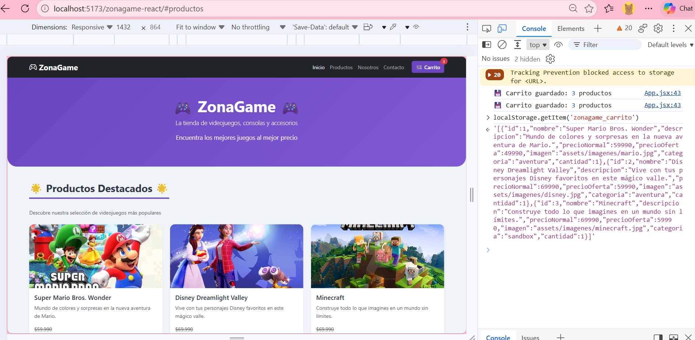
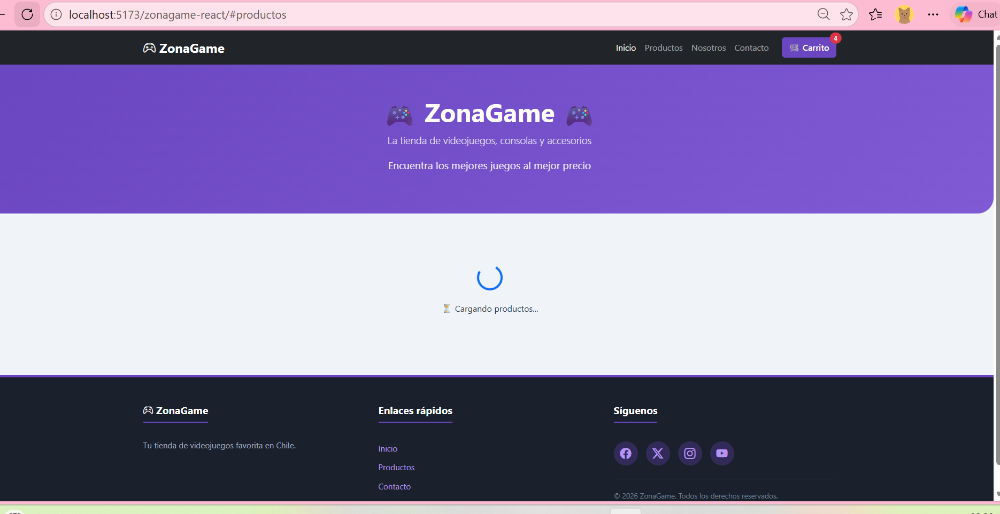
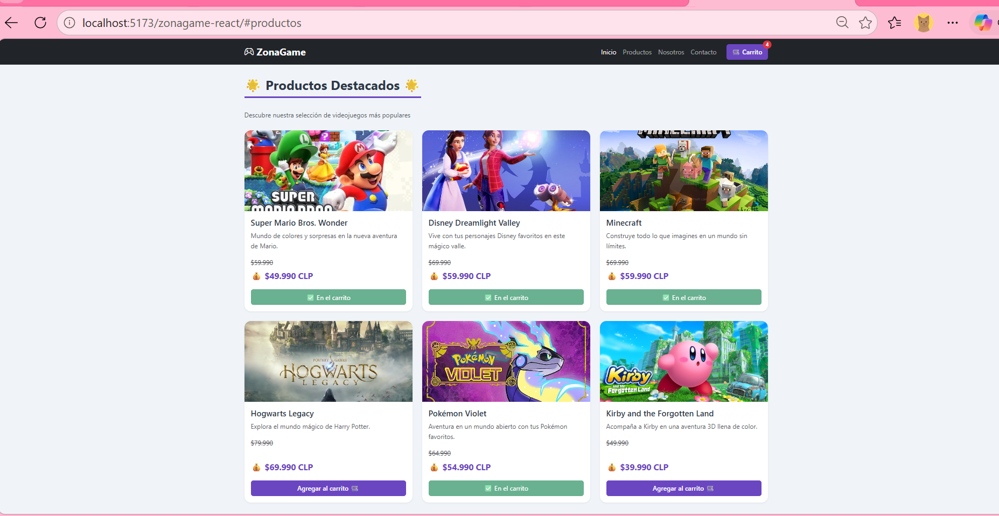
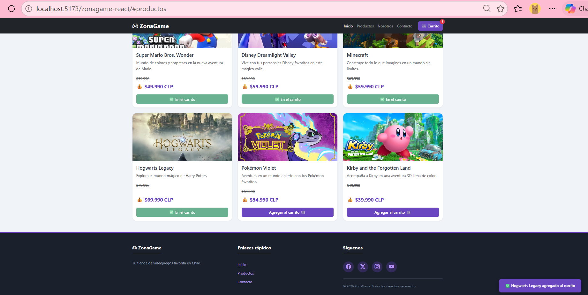
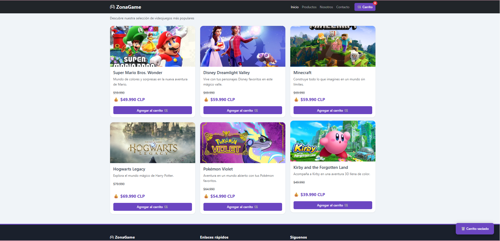
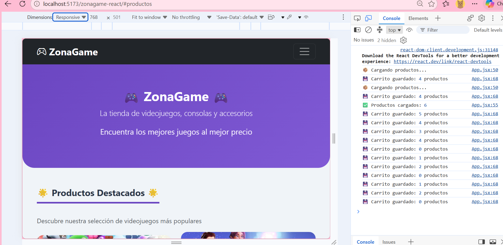
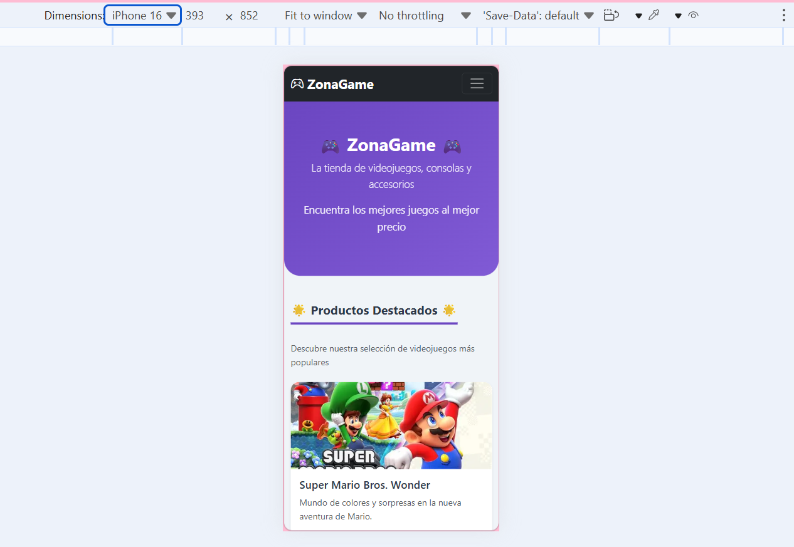
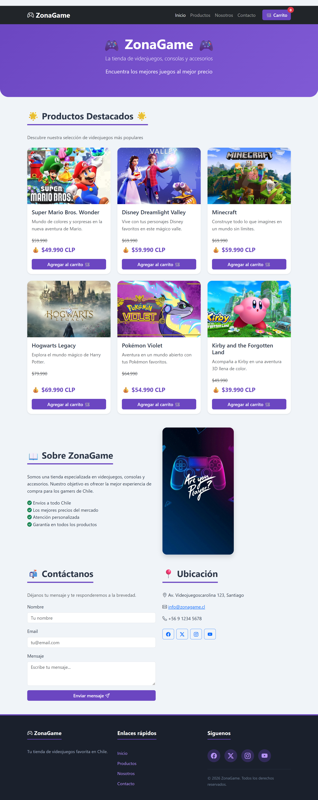

# 🎮 ZonaGame - Tienda de Videojuegos (React)

## Actividad Sumativa - Semana 8
### Mejorando funcionalidades clave en el eCommerce con React

---

## Descripción

Aplicación de eCommerce para una tienda de videojuegos llamada **"ZonaGame"**, desarrollada con **React** y **Vite**. Implementa componentes funcionales, Hooks (`useState` y `useEffect`), renderizado condicional, persistencia de datos con `localStorage` y manejo de efectos secundarios.

---

## Funcionalidades implementadas

### Gestión de estados con useState
- **Catálogo de productos:** cargado dinámicamente
- **Carrito de compras:** agregar, eliminar, vaciar
- **Modal del carrito:** mostrar/ocultar
- **Estado de carga:** spinner mientras carga
- **Notificaciones:** mensajes flotantes de confirmación

### Efectos secundarios con useEffect
- **Carga simulada de productos** desde `productos.js` (con spinner)
- **Persistencia automática del carrito** en localStorage
- **Guardado automático** cuando el carrito cambia

### Renderizado condicional
- **Spinner de carga** mientras se cargan los productos
- **Botón del producto cambia:**
  - 🛒 "Agregar al carrito" (si NO está en el carrito)
  - ✅ "En el carrito" (si YA está)
- **Mensaje de carrito vacío** cuando no hay productos
- **Notificación flotante** al agregar/eliminar productos

### Persistencia con localStorage
- El carrito se guarda automáticamente
- Al recargar la página, el carrito se mantiene
- Los productos en el carrito se recuperan al abrir la app

### Secciones adicionales
- **Hero** con presentación de la tienda
- **Productos Destacados** con carga dinámica
- **Nosotros** con información de la tienda
- **Contacto** con formulario y datos
- **Footer** con enlaces y redes sociales

### Componentes React creados
| Componente | Descripción |
|-----------|-------------|
| `Navbar.jsx` | Barra de navegación con contador dinámico |
| `ProductoCard.jsx` | Tarjeta con botón condicional |
| `ListaProductos.jsx` | Grid de todos los productos |
| `Carrito.jsx` | Modal con renderizado condicional |

---

## Estructura del proyecto

```text
zonagame-react/
├── index.html
├── package.json
├── vite.config.js
├── README.md
├── public/
│   └── assets/
│       └── imagenes/
│           ├── mario.jpg
│           ├── disney.jpg
│           ├── minecraft.jpg
│           ├── hogwarts.jpg
│           ├── pokemon.jpg
│           └── kirby.jpg
├── capturas/
│   ├── semana8_captura1_localStorage.png
│   ├── semana8_captura2_spinner.png
│   ├── semana8_captura3_boton_verde.png
│   ├── semana8_captura4_notificacion.png
│   ├── semana8_captura5_carrito_vacio.png
│   ├── semana8_captura6_consola.png
│   ├── semana8_captura7_movil.png
│   └── semana8_captura_web_completa.png
└── src/
    ├── components/
    │   ├── Navbar.jsx
    │   ├── ProductoCard.jsx
    │   ├── ListaProductos.jsx
    │   └── Carrito.jsx
    ├── data/
    │   └── productos.js
    ├── App.jsx
    ├── App.css
    ├── index.css
    └── main.jsx
```

---

## Capturas de pantalla

### Persistencia con localStorage


### Spinner de carga (useEffect)


### Botón condicional "En el carrito"


### Notificación flotante


### Carrito vacío (mensaje)


### Consola sin errores


### Vista responsive (móvil)


### Página completa


---

## Tecnologías utilizadas

| Tecnología | Descripción |
|------------|-------------|
| **React 19** | Biblioteca principal para la interfaz |
| **Vite** | Empaquetador y servidor de desarrollo |
| **JavaScript (ES6+)** | Lógica del carrito y estados |
| **useState** | Manejo de estados |
| **useEffect** | Efectos secundarios (carga, persistencia) |
| **localStorage** | Persistencia del carrito |
| **Bootstrap 5** | Estilos y componentes visuales |
| **CSS3** | Estilos personalizados |
| **GitHub Pages** | Publicación del sitio en línea |

---

## Cómo ejecutar el proyecto

### Requisitos previos
- Node.js v18 o superior
- npm (viene con Node.js)

### Instalación

```bash
# 1. Clonar el repositorio
git clone https://github.com/carosolis45/zonagame-react.git

# 2. Entrar al proyecto
cd zonagame-react

# 3. Instalar dependencias
npm install

# 4. Ejecutar el servidor de desarrollo
npm run dev
```

Abrir en el navegador: `http://localhost:5173/`

### Comandos disponibles

| Comando | Descripción |
|---------|-------------|
| `npm run dev` | Inicia el servidor de desarrollo |
| `npm run build` | Genera la versión de producción en `dist/` |
| `npm run preview` | Previsualiza la versión de producción |

---

## Enlaces

- **Repositorio:** https://github.com/carosolis45/zonagame-react
- **GitHub Pages:** https://carosolis45.github.io/zonagame-react/

---

## Datos del estudiante

- **Nombre:** Carolina Solís
- **Curso:** Frontend I
- **Semana:** 8 - Sumativa
- **Fecha:** 4 Octubre 2026

---

*Actividad realizada para la asignatura de Frontend I - Sumativa (Semana 8)*

