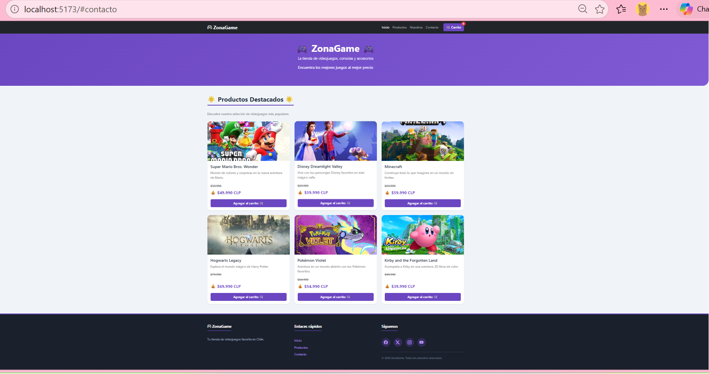
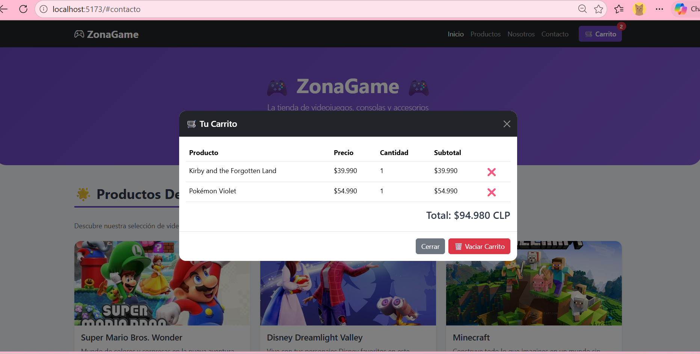
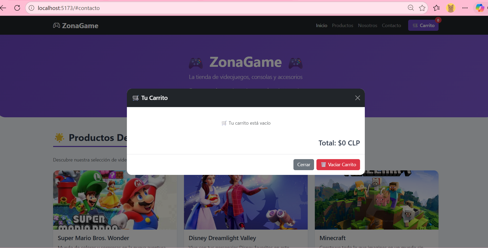
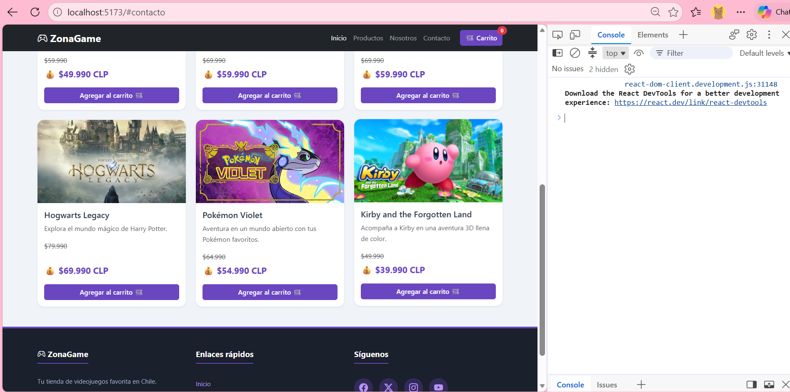
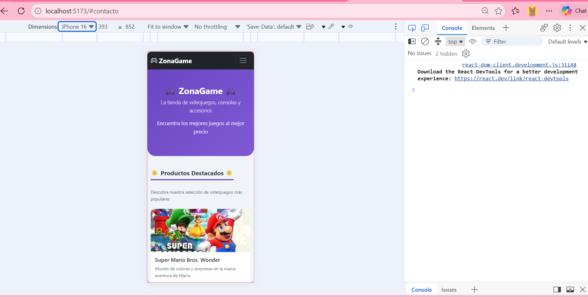

# 🎮 ZonaGame - Tienda de Videojuegos (React)

## Actividad Formativa- Semana 7
### Construyendo componentes funcionales en React para un eCommerce interactivo

---

## Descripción

Aplicación de eCommerce para una tienda de videojuegos llamada **"ZonaGame"**, desarrollada con **React** y **Vite**. Implementa componentes funcionales, Hooks como `useState`, renderizado condicional y un carrito de compras interactivo.

---

## Funcionalidades implementadas

### Listado de productos
Cada producto incluye:
- Nombre del producto
- Precio normal
- Precio de oferta
- Descripción corta
- Imagen del producto

### Carrito de compras
- Agregar productos al carrito
- Eliminar productos individualmente
- Vaciar el carrito completo
- Contador dinámico de productos
- Total calculado automáticamente
- Modal con tabla de productos y subtotales

### Componentes React creados
| Componente | Descripción |
|-----------|-------------|
| `Navbar.jsx` | Barra de navegación con contador del carrito |
| `ProductoCard.jsx` | Tarjeta individual de producto |
| `ListaProductos.jsx` | Grid de todos los productos |
| `Carrito.jsx` | Modal con tabla del carrito |

### Hooks utilizados
- **`useState`**: Para manejar el estado del carrito y del modal

### Renderizado condicional
- El modal se muestra/oculta según el estado
- El carrito vacío muestra un mensaje diferente
- Los productos muestran precio normal y precio de oferta

---

## Estructura del proyecto

```text
zonagame-react/
├── index.html
├── package.json
├── vite.config.js
├── README.md
├── public/
│   └── assets/
│       └── imagenes/
│           ├── mario.jpg
│           ├── disney.jpg
│           ├── minecraft.jpg
│           ├── hogwarts.jpg
│           ├── pokemon.jpg
│           └── kirby.jpg
└── src/
    ├── components/
    │   ├── Navbar.jsx
    │   ├── ProductoCard.jsx
    │   ├── ListaProductos.jsx
    │   └── Carrito.jsx
    ├── data/
    │   └── productos.js
    ├── App.jsx
    ├── App.css
    ├── index.css
    └── main.jsx

Capturas de pantalla

### Página principal con productos


### Carrito con productos


### Carrito vacío


### Consola sin errores


### Vista responsive (móvil)


Tecnologías utilizadas
Tecnología	Descripción
React 19	Biblioteca principal para la interfaz
Vite	Empaquetador y servidor de desarrollo
JavaScript (ES6+)	Lógica del carrito y estados
useState (Hook)	Manejo del estado de React
Bootstrap 5	Estilos y componentes visuales
CSS3	Estilos personalizados
GitHub Pages	Publicación del sitio en línea

Cómo ejecutar el proyecto
Requisitos previos
Node.js v18 o superior

npm (viene con Node.js)

Instalación

# 1. Clonar el repositorio
git clone https://github.com/carosolis45/zonagame-react.git

# 2. Entrar al proyecto
cd zonagame-react

# 3. Instalar dependencias
npm install

# 4. Ejecutar el servidor de desarrollo
npm run dev
Abrir en el navegador: http://localhost:5173/

Comandos disponibles
Comando	Descripción
npm run dev	Inicia el servidor de desarrollo
npm run build	Genera la versión de producción en dist/
npm run preview	Previsualiza la versión de producción

Enlaces
Repositorio: https://github.com/carosolis45/zonagame-react

GitHub Pages: https://carosolis45.github.io/zonagame-react/

Datos 
Nombre: Carolina Solís
Curso: Frontend I
Semana: 7 - Formativa
Fecha: 28 Septiembre 2026

